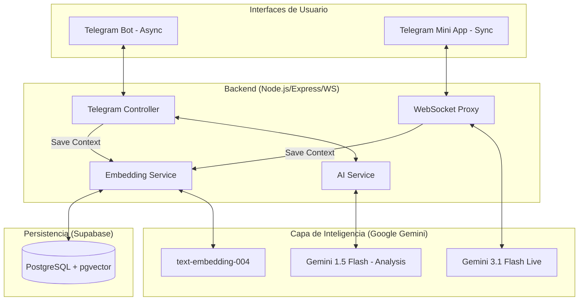

# 🏛️ Senior Technical Architecture: AI English Voice Coach

Esta guía documenta la infraestructura completa del sistema, diseñada para asegurar la escalabilidad, el mantenimiento y la comprensión profunda de cada decisión arquitectónica.

## 1. Visión General del Sistema
El sistema es un ecosistema multimodal diseñado para la enseñanza del idioma inglés, aprovechando la baja latencia de la Gemini 3.1 Live API para interacciones de voz y la persistencia de una base de datos vectorial para el aprendizaje continuo.

## 2. Diagrama de Arquitectura (Flujo de Datos)

---

## 3. Módulos y Componentes

### 3.1. WebSocket Proxy (`src/app.ts`)
**Definición:** Actúa como un puente (Bridge) bidireccional entre el navegador del usuario y los servidores de Google.
- **Por qué se usa:** Google requiere firmas seguras y un protocolo WebSocket específico (BidiGenerateContent) que no debe exponerse directamente en el cliente por seguridad de la API Key.
- **Lógica de Interrupción:** Utiliza un flag de estado para descartar paquetes de audio residuales cuando el usuario interrumpe a la IA.

### 3.2. Embedding Service (`src/services/embedding.service.ts`)
**Definición:** Motor de búsqueda semántica.
- **Funcionamiento:** Convierte texto en vectores de 768 dimensiones.
- **Operador <=>**: Utiliza la distancia de coseno para encontrar "ideas cercanas" en la base de datos.
- **Justificación:** Permite que el bot tenga memoria sin necesidad de leer todo el historial cada vez (lo cual sería carísimo y lento).

### 3.3. Telegram Controller (`src/controllers/telegram.controller.ts`)
**Definición:** Orquestador de la interfaz asíncrona.
- **Responsabilidad:** Gestiona comandos, mensajes de voz de Telegram y lanza los retos proactivos.

---

## 4. Decisiones de Diseño Críticas

| Decisión | Justificación Técnica |
| :--- | :--- |
| **Protocolo PCM 16/24kHz** | El audio crudo (PCM) sin compresión reduce la latencia de procesamiento al evitar el overhead de encoding/decoding en el servidor. |
| **RAG (Retrieval Augmented Generation)** | En lugar de entrenar un modelo, inyectamos contexto en el prompt. Es más barato, instantáneo y preciso para el historial de un usuario. |
| **Arquitectura de Micro-Servicios en un Monolito** | Aunque el código es uno solo, los servicios están desacoplados para que mañana el `EmbeddingService` pueda ser un microservicio independiente. |

---

## 5. Seguridad y Escalabilidad
- **Variables de Entorno**: Centralizadas en `src/config/env.ts` usando **Zod** para validación en tiempo de compilación. No se permite arrancar el sistema si falta una llave.
- **Pool de Conexiones**: Prisma gestiona la saturación de conexiones a Supabase para evitar caídas en picos de tráfico.

## 6. Motor de Aprendizaje (Post-Session Analysis)
Al finalizar cada interacción (voz o texto), el sistema ejecuta una "Reflexión Pedagógica":
1. Recopila la transcripción.
2. Solicita a Gemini 1.5 Flash un análisis de errores.
3. El resultado se vectoriza y se guarda.
*Este proceso es asíncrono para no bloquear la experiencia del usuario.*

---

## 7. Glosario para el Arquitecto
- **Latency (Latencia)**: Tiempo que tarda un paquete de audio en ir y volver. Nuestra meta es <500ms.
- **Cosine Similarity**: Medida matemática de qué tan parecidos son dos vectores.
- **Handshake**: El proceso inicial de conexión donde se validan credenciales y se configura el modelo.
